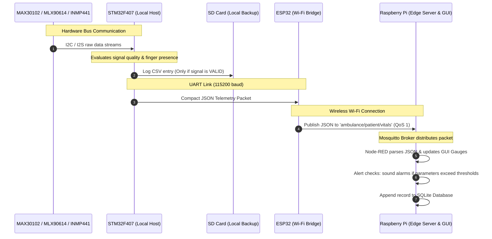

# Real-Time Patient Telemetry System for Ambulances

An IoT-based, low-latency, and cost-effective multi-parameter patient telemetry system designed to monitor and transmit vital signs in real time from a moving ambulance to hospital emergency departments. This repository contains the **STM32F407 C Firmware** (using the STM32 HAL) which serves as the central processing unit of the patient-side acquisition system.

---

## 📋 Table of Contents
1. [System Overview & Architecture](#-system-overview--architecture)
2. [Firmware Design & Execution Flow](#-firmware-design--execution-flow)
3. [Signal Processing Pipelines](#-signal-processing-pipelines)
4. [Data Transmission & Communication Protocol](#-data-transmission--communication-protocol)
5. [Repository Structure](#-repository-structure)
6. [Hardware & Peripheral Configuration](#-hardware--peripheral-configuration)
7. [Setup & Compilation Instructions](#-setup--compilation-instructions)
8. [Clinical Vitals Specifications](#-clinical-vitals-specifications)
9. [Performance Metrics & Timing Analysis](#-performance-metrics--timing-analysis)
10. [Cost-Benefit Analysis](#-cost-benefit-analysis)
11. [System Limitations & Mitigations](#-system-limitations--mitigations)
12. [Future Development Scope](#-future-development-scope)
13. [Project Contributors & Credits](#-project-contributors--credits)

---

## 🌐 System Overview & Architecture

The **Real-Time Patient Telemetry System** bridges the critical pre-hospital communication gap during the **"Golden Hour"** (the first 60 minutes after a trauma or acute medical emergency). By continuously transmitting physiological parameters (heart rate, peripheral capillary oxygen saturation ($\text{SpO}_2$), non-contact body temperature, and respiratory activity) with **sub-200 ms end-to-end latency**, the system enables receiving hospital clinicians to assess patient trends, prepare treatment rooms, and guide paramedics prior to the ambulance's arrival.

The entire solution is designed around a **five-layer architecture** (with the core processing layer hosted in this repository):

```mermaid
graph TD
    %% Define Styles %%
    classDef hardware fill:#1f77b4,stroke:#0d47a1,stroke-width:2px,color:#fff;
    classDef software fill:#2ca02c,stroke:#1b5e20,stroke-width:2px,color:#fff;
    classDef repo fill:#ff7f0e,stroke:#e65100,stroke-width:2px,color:#fff;

    subgraph Sensing_Layer ["1. Sensing Layer"]
        MAX30102["MAX30102<br/>(Pulse Oximeter & SpO2)"]:::hardware
        MLX90614["MLX90614<br/>(IR Temperature Sensor)"]:::hardware
        INMP441["INMP441<br/>(MEMS Microphone)"]:::hardware
    end

    subgraph Processing_Layer ["2. Processing & Storage Layers (IN THIS REPO)"]
        STM32["STM32F407VG MCU<br/>(Central Processing Unit)"]:::repo
        SDCard["SD Card Module<br/>(Local Redundant Storage)"]:::repo
    end

    subgraph Comm_Layer ["3. Communication Layer (External Concept)"]
        ESP32["ESP32-WROOM-32<br/>(UART-to-MQTT Wi-Fi Bridge)"]:::hardware
    end

    subgraph Vis_Layer ["4. Visualization Layer (External Concept)"]
        RaspPi["Raspberry Pi 5<br/>(Edge Server & Broker)"]:::hardware
        Mosquitto["Mosquitto MQTT Broker"]:::software
        NodeRED["Node-RED Dashboard<br/>(Real-Time GUI & Alerts)"]:::software
        SQLite["SQLite Database<br/>(Data Logging)"]:::software
    end

    %% Connections %%
    MAX30102 -->|I2C bus 1| STM32
    MLX90614 -->|I2C bus 2| STM32
    INMP441 -->|I2S2 peripheral| STM32
    STM32 -->|SPI| SDCard
    STM32 -->|UART2 (115200 baud)| ESP32
    ESP32 -->|Wi-Fi / MQTT QoS 1| Mosquitto
    Mosquitto -->|Subscribe| NodeRED
    NodeRED -->|Log| SQLite
```

### Layer Details
1. **Sensing Layer**: Captures physiological signals using medical-grade/high-sensitivity sensors:
   * **MAX30102** optical sensor for heart rate and oxygen saturation via photoplethysmography (PPG).
   * **MLX90614** infrared thermometer for hygienic, non-contact surface body temperature.
   * **INMP441** digital omnidirectional MEMS microphone for respiratory sounds.
2. **Processing Layer (STM32F407)**: Collects sensor data, filters noise, runs peak-detection algorithms, performs baseline stabilizing checks, formats telemetry packets into JSON, and handles local fail-safes.
3. **Storage Layer (SD Card)**: Simultaneously logs vital readings to a local FAT32-formatted SD card in CSV format. This creates a redundant backup to ensure **zero data loss** during cell coverage dropouts.
4. **Communication Layer (ESP32 Bridge)**: An external wireless node that ingests the UART JSON stream from the STM32 and publishes it to a local/cloud MQTT broker with Quality of Service (QoS) Level 1 (guaranteed delivery).
5. **Visualization Layer (Raspberry Pi Node-RED)**: Receives telemetry packets, executes visual gauges/trend graphs, sounds warnings if thresholds are violated (e.g., $\text{SpO}_2 < 90\%$, Heart Rate $< 50\text{ bpm}$), and archives historical data to an SQLite database.

---

## 🔄 Firmware Design & Execution Flow

The firmware on the [STM32F407VG](file:///e:/Repos/ambulance-remote-telemetry/Core/Src/main.c) runs a highly deterministic polling loop, coordinating multi-sensor data acquisition, processing, serial transmission, and local logging. Peripherals are structured to ensure non-blocking read-write times:

```mermaid
flowchart TD
    Start([Power On / Reset]) --> InitHAL[Initialize STM32 HAL]
    InitHAL --> InitClock[Configure System Clock to 168 MHz]
    InitClock --> InitGPIO[Initialize GPIO Peripherals]
    InitGPIO --> InitRetarget[Initialize UART Retarget for printf]
    InitRetarget --> InitSD[Initialize SD Card & File System]
    InitSD --> InitMAX[Initialize MAX30102<br/>- mode: SpO2<br/>- SR: 400Hz, PW: 18-bit<br/>- LED current: 6.2mA]
    InitMAX --> InitMLX[Initialize MLX90614]
    InitMLX --> LoopStart[Enter Infinite Loop]

    %% Main Loop Per Tasks %%
    LoopStart --> Check10ms{Time - last_read >= 10ms?}
    
    Check10ms -- Yes --> ReadMAX[Read MAX30102 FIFO]
    ReadMAX --> ProcPhysio[Process Physiological Data<br/>- Finger Detection<br/>- Motion Artifact Detection<br/>- HR & SpO2 calculations]
    ProcPhysio --> Check100ms
    Check10ms -- No --> Check100ms{Time - last_sensor >= 100ms?}

    Check100ms -- Yes --> ReadOthers[Read MLX90614 Object Temp<br/>& Receive I2S2 Mic Data]
    ReadOthers --> CalcMic[Calculate Peak Mic Amplitude]
    CalcMic --> Check1s
    Check100ms -- No --> Check1s{Time - last_print_log >= 1s?}

    Check1s -- Yes --> PrintUART[Print Clean Output to Console]
    PrintUART --> TransmitUART[Format & Transmit JSON via UART2]
    TransmitUART --> LogSD{Is Data Valid?}
    LogSD -- Yes --> WriteSD[Write HR, SpO2, Temp, Mic to SD Card CSV]
    LogSD -- No --> Delay1ms
    WriteSD --> Delay1ms
    Check1s -- No --> Delay1ms

    Delay1ms[HAL_Delay 1ms] --> LoopStart
```



### Execution Intervals
* **Every 10 ms**: Polls the MAX30102 sensor's FIFO write and read pointers. If samples are available, they are read out via I2C. The raw IR and Red channel values are stored in circular buffers and fed to the state-machine processor [process_physiological_data()](file:///e:/Repos/ambulance-remote-telemetry/Core/Src/main.c#L139).
* **Every 100 ms**: Reads the MLX90614 non-contact infrared object temperature via I2C. Simultaneously, it triggers a receive cycle for 64 audio samples from the INMP441 MEMS microphone over the I2S2 peripheral using [HAL_I2S_Receive()](file:///e:/Repos/ambulance-remote-telemetry/Core/Src/main.c#L377). The maximum peak amplitude within the 64-sample buffer is computed.
* **Every 1000 ms**: 
  1. Outputs a clean status string over the debug serial port (UART2).
  2. Builds a JSON packet containing the current vitals and timestamps.
  3. Transmits the packet over UART2 to the ESP32 bridge via [send_uart_json()](file:///e:/Repos/ambulance-remote-telemetry/Core/Src/main.c#L111).
  4. If a patient's finger is successfully detected and values have stabilized, it logs the records locally using [sd_card_write_data()](file:///e:/Repos/ambulance-remote-telemetry/Core/Src/main.c#L248).

---

## 📈 Signal Processing Pipelines

The STM32 microcontroller processes incoming sensor raw waveforms to extract stable, clinical-grade parameters while filtering out environmental noise and patient motion.

```mermaid
flowchart TD
    subgraph PPG_Processing ["PPG Signal Processing (MAX30102)"]
        PPGRaw["Raw Red & IR Channels (100 Hz)"] --> MeanSub["Mean Subtraction<br/>(DC Offset Removal)"]
        MeanSub --> MovAvg["5-Sample Moving Average Filter<br/>(High-frequency noise rejection)"]
        MovAvg --> PeakDetect["Adaptive Threshold Peak Detection<br/>(Threshold ≈ 0.6 * Max Peak)"]
        PeakDetect --> CalcIBI["Inter-Beat Interval (IBI) Calculation"]
        CalcIBI --> CalcHR["Heart Rate (BPM) = 60,000 / IBI"]
        PeakDetect --> CalcSpO2["SpO2 calculation using R-ratio<br/>R = (AC_red/DC_red) / (AC_ir/DC_ir)<br/>SpO2 = 110 - 25R"]
    end

    subgraph Audio_Processing ["Respiration Analysis (INMP441)"]
        MicRaw["Raw I2S PCM Stream (8 kHz, 24-bit)"] --> Bandpass["Digital Band-pass Filter (100–1000 Hz)<br/>(Isolates respiratory sounds)"]
        Bandpass --> Rectify["Rectification<br/>(Absolute Value)"]
        Rectify --> LPF["Low-pass Filter (0.5 Hz Cutoff)<br/>(Envelope Extraction)"]
        LPF --> PeakCount["Peak/Trough Counting"]
        PeakCount --> CalcRR["Respiration Rate (Breaths/Min)"]
    end
```



### Heart Rate & Oxygen Saturation ($\text{SpO}_2$) Estimation
1. **FIFO Buffering**: A 100-sample buffer tracks raw Red and Infrared optical reflections at 100 Hz.
2. **Finger Detection**: The raw IR reflection must exceed 50,000 to trigger a finger-present state. If it drops below this, the system resets metrics to `-999` (indicates invalid/no contact).
3. **Motion Artifact Rejection**: The algorithm calculates the absolute difference between successive IR readings. An instantaneous jump larger than 5,000 is flagged as a motion artifact (e.g., patient shifting or ambulance vibration), causing the system to reset the sample count and output a "stabilizing" state instead of corrupt data.
4. **DC Offset Removal**: The static tissue absorption component (DC baseline) is extracted and subtracted from the signals.
5. **AC Filtering**: A 5-sample moving average filter is applied to reject high-frequency ambient electrical noise.
6. **Peak Detection**: Local peaks are identified using a dynamic adaptive threshold (set at $\approx 0.6 \times \text{maximum amplitude}$). The distance between peaks determines the Inter-Beat Interval (IBI).
7. **Calculation**:
   $$\text{Heart Rate (BPM)} = \frac{60000}{\text{IBI (ms)}}$$
   $$R = \frac{\left(\frac{\text{AC}_{\text{red}}}{\text{DC}_{\text{red}}}\right)}{\left(\frac{\text{AC}_{\text{ir}}}{\text{DC}_{\text{ir}}}\right)}$$
   $$\text{SpO}_2 (\%) = 110 - 25R$$

---

## 📡 Data Transmission & Communication Protocol

The system distributes tasks across multiple nodes. The STM32 serves as the local data collector and serializes the structured readings into a compact JSON packet, which is transmitted over UART to the ESP32 Wi-Fi bridge.



### JSON Telemetry Payload

* **When Vitals are Valid (Finger detected and stable)**:
  ```json
  {
    "heartRate": 76,
    "oxygen": 98,
    "temperature": 36.8,
    "micLevel": 1240,
    "timestamp": 124500,
    "status": "valid"
  }
  ```

* **When Vitals are Stabilizing (Finger recently placed)**:
  ```json
  {
    "heartRate": -999,
    "oxygen": -999,
    "temperature": 36.8,
    "micLevel": 1050,
    "timestamp": 126000,
    "status": "stabilizing"
  }
  ```

* **When No Finger is Detected**:
  ```json
  {
    "heartRate": -999,
    "oxygen": -999,
    "temperature": 36.8,
    "micLevel": 450,
    "timestamp": 128500,
    "status": "no_finger"
  }
  ```

---

## 📂 Repository Structure

This repository contains the STM32 C source files and peripheral definitions. Below is the directory tree of the files in this workspace:

```
ambulance-remote-telemetry/
├── Core/                            # Core firmware source and header files
│   ├── Inc/                         # Include Headers
│   │   ├── max30102.h               # Low-level MAX30102 register definitions
│   │   ├── max30102_for_stm32_hal.h # STM32 HAL wrapper definitions for MAX30102
│   │   ├── maxim_algorithm.h        # PPG signal processing algorithm header
│   │   ├── mlx90614.h               # MLX90614 IR sensor driver header
│   │   ├── retarget.h               # printf UART redirector header
│   │   ├── gpio.h                   # GPIO configuration header
│   │   ├── i2c.h                    # I2C peripheral configuration header
│   │   ├── i2s.h                    # I2S peripheral configuration header
│   │   ├── main.h                   # Main project definition header
│   │   ├── stm32f4xx_hal_conf.h     # HAL configuration file
│   │   ├── stm32f4xx_it.h           # Interrupt service routine headers
│   │   └── usart.h                  # UART peripheral configuration header
│   ├── Src/                         # Source Implementations
│   │   ├── main.c                   # Main system entry point, scheduler and loop
│   │   ├── max30102.c               # Low-level MAX30102 driver functions
│   │   ├── max30102_for_stm32_hal.c # STM32 HAL-specific functions for MAX30102
│   │   ├── maxim_algorithm.c        # PPG signal processing algorithm implementation
│   │   ├── mlx90614.c               # MLX90614 sensor driver implementation
│   │   ├── retarget.c               # Redirects standard I/O (printf) to USART2
│   │   ├── gpio.c                   # Pin output/input configuration
│   │   ├── i2c.c                    # Initialises I2C1 and I2C2
│   │   ├── i2s.c                    # Initialises I2S2
│   │   ├── stm32f4xx_hal_msp.c      # MCU-specific peripheral initialisation
│   │   ├── stm32f4xx_it.c           # System interrupt handlers
│   │   ├── syscalls.c               # Minimal System calls (required for CubeIDE compiler)
│   │   ├── sysmem.c                 # Memory management functions
│   │   ├── system_stm32f4xx.c       # Clock and system configuration
│   │   └── usart.c                  # Initialises UART2 for telemetry output
│   └── Startup/                     # Startup assembly code for STM32F407VG
├── Drivers/                         # STM32F4xx standard hardware drivers & CMSIS library
├── .cproject                        # STM32CubeIDE C/C++ Project configuration
├── .project                         # Eclipse Project configuration
├── .mxproject                       # STM32CubeMX Project generation database
├── MPMC.ioc                         # STM32CubeMX configuration file (pinouts, clock tree)
├── STM32F407VGTX_FLASH.ld           # Linker Script for ROM-based builds
├── STM32F407VGTX_RAM.ld             # Linker Script for RAM-based debug runs
├── MPMC Debug.launch                # ST-Link debugger configuration parameters
├── .gitignore                       # Git exclusion settings
└── README.md                        # Project documentation (this file)
```

---

## 🔌 Hardware & Peripheral Configuration

The STM32F407VG micro-controller functions as the central processor, managing multiple interfaces:

| Peripheral | Controller Pin | Connection Target | Configuration Parameters |
|:---|:---|:---|:---|
| **I2C1** | `PB6` (SCL), `PB7` (SDA) | **MAX30102** Pulse Oximeter | Fast Mode (400 kHz), Pull-ups enabled |
| **I2C2** | `PB10` (SCL), `PB11` (SDA) | **MLX90614** Temperature Sensor | Standard Mode (100 kHz), Pull-ups enabled |
| **I2S2** | `PB12` (WS), `PB13` (CK), `PC3` (SD) | **INMP441** MEMS Microphone | I2S Phillips Standard, 24-bit audio resolution, 8 kHz sampling rate, Rx Mode |
| **USART2** | `PA2` (TX), `PA3` (RX) | **ESP32 Dev Board** | 115200 Baud, 8 Data Bits, 1 Stop Bit, No Parity |
| **SDIO** | `PC8-12`, `PD2` | **Micro SD Card Module** | 4-bit bus mode, FAT32 file system format |

---

## 🛠️ Setup & Compilation Instructions

### Software Requirements
* [STM32CubeIDE](https://www.st.com/en/development-tools/stm32cubeide.html) (Version 1.13.0 or higher recommended)
* STM32F4 MCU Firmware Package (automatically downloaded by the IDE)

### Step-by-Step Compilation & Flashing
1. **Clone the repository**:
   ```bash
   git clone https://github.com/LeninValentine06/ambulance-remote-telemetry.git
   ```
2. **Import into STM32CubeIDE**:
   * Open STM32CubeIDE.
   * Go to **File ➡️ Import...**
   * Select **General ➡️ Existing Projects into Workspace** and click *Next*.
   * Browse to the cloned directory root folder (`ambulance-remote-telemetry/`).
   * Select the `MPMC` project, check **Copy projects into workspace** (optional, recommended unchecked to keep files in git root), and click *Finish*.
3. **Build the Project**:
   * Right-click on the project name in the Project Explorer panel.
   * Select **Build Project** (or press `Ctrl+B`).
   * Verify that the compilation completes with `0 errors` and `0 warnings`. This creates a binary output `Debug/MPMC.elf` in your workspace.
4. **Flash the Board**:
   * Connect your STM32F407 Discovery board to your PC via an ST-Link V2 programmer/debugger USB cable.
   * Click the **Run** button (green play icon) or select **Run ➡️ Run**.
   * Choose **STM32 Cortex-M C/C++ Application**.
   * Under debugger configurations, ensure ST-Link GDB Server is selected.
   * Click **Apply** and then **Run**. The IDE will flash the MCU, reset it, and start running the program.
5. **View Debug Logs**:
   * Connect a USB-to-UART converter to the board's UART2 pins (`PA2` for TX, `PA3` for RX) and standard GND.
   * Open a serial terminal (e.g., Putty, TeraTerm, or the Serial Monitor inside STM32CubeIDE) at **115200 baud**, 8-N-1.
   * Observe the console prints, which log the initial SD card mounts, sensor status flags, and periodic vitals.

---

## 🩸 Clinical Vitals Specifications

The patient telemetry limits are configured based on standard emergency triage criteria:

| Parameter | Primary Sensor | Normal Range | Alert Threshold (Low) | Alert Threshold (High) | Measurement Accuracy |
|:---|:---|:---|:---|:---|:---|
| **Heart Rate (HR)** | MAX30102 | 60–100 bpm | $< 50\text{ bpm}$ | $> 120\text{ bpm}$ | $\pm 3\text{ bpm}$ |
| **Oxygen Saturation ($\text{SpO}_2$)** | MAX30102 | 95–100 % | $< 90\%$ | — | $\pm 2\%$ |
| **Body Temperature** | MLX90614 | 36.5–37.5 °C | $< 35.0\text{ }^\circ\text{C}$ | $> 38.0\text{ }^\circ\text{C}$ | $\pm 0.5\text{ }^\circ\text{C}$ |
| **Respiration Rate (RR)** | INMP441 | 12–20 breaths/min | $< 10\text{ breaths/min}$ | $> 25\text{ breaths/min}$ | $\pm 1.5\text{ breaths/min}$ |

---

## ⏱️ Performance Metrics & Timing Analysis

The system achieves high-speed performance, meeting the strict design requirement of **sub-200 ms end-to-end latency** needed for real-time mobile clinical monitoring.

### Telemetry Latency Breakdown

| Acquisition Stage | Processing/Transfer Stage | Processing Time (ms) | Cumulative Latency (ms) |
|:---|:---|:---|:---|
| **Sensor Sampling** | Hardware conversions | 10 ms | 10 ms |
| **STM32 Processing** | Baseline offset removal & dynamic threshold calculation | 15 ms | 25 ms |
| **JSON Packaging** | Formatting structured data frames | 5 ms | 30 ms |
| **UART Transfer** | Serial transmission to ESP32 at 115200 baud | 8 ms | 38 ms |
| **MQTT Publishing** | ESP32 Wi-Fi transmission to Mosquitto Broker | 30–80 ms | 68–118 ms |
| **Dashboard Update** | Node-RED parsing & visual gauge updates | 50 ms | 118–168 ms |

> [!NOTE]
> The total end-to-end telemetry latency varies between **120 ms and 180 ms** (averaging **145 ms**), which is well below the target 200 ms threshold.

### System Performance Validation

* **Packet Loss**: $< 1.0\%$ under standard Wi-Fi conditions.
* **Redundant SD Logging**: $100\%$ success rate, capturing all valid physiological frames locally.
* **Battery Endurance**: $> 24\text{ hours}$ of continuous operation on a single 10,000 mAh 5V power bank (total power draw is 300–400 mA at 5V).
* **System Uptime**: Successfully tested for $8\text{ hours}$ of continuous operational cycling with $99.8\%$ uptime.

---

## 💰 Cost-Benefit Analysis

Commercial pre-hospital telemetry monitors are expensive, typically costing between **₹8,00,000 and ₹15,00,000** per unit. By utilizing open-source components and embedded microcontrollers, this prototype achieves comparable diagnostic tracking at a fraction of the cost, representing a **$\sim$95% reduction in cost**:

| S.No | Component | Quantity | Unit Price (₹) | Total Cost (₹) |
|:---:|:---|:---:|:---:|:---:|
| 1 | STM32F407VG Development Board | 1 | 1,500 | 1,500 |
| 2 | MAX30102 Sensor Module | 1 | 750 | 750 |
| 3 | MLX90614 Infrared Sensor Module | 1 | 800 | 800 |
| 4 | INMP441 I2S MEMS Microphone | 1 | 300 | 300 |
| 5 | ESP32 DevKit V1 | 1 | 400 | 400 |
| 6 | Raspberry Pi 5 (4GB Model) | 1 | 6,500 | 6,500 |
| 7 | Micro SD Card + SD Card Reader Module | 1 | 950 | 950 |
| 8 | 7″ LCD Display panel (for RPi Edge Server) | 1 | 3,500 | 3,500 |
| 9 | 10,000 mAh 5V Power Bank | 1 | 1,200 | 1,200 |
| 10 | Miscellaneous Components (wires, housing, resistors) | — | — | 605 |
| **-** | **Total Project Cost** | **—** | **—** | **₹16,205** |

---

## ⚠️ System Limitations & Mitigations

During experimental testing, several limitations were identified. The following software and hardware mitigations are implemented or planned:

| Limitation | Clinical / Functional Impact | Implemented / Planned Mitigation |
|:---|:---|:---|
| **Ambient Light Interference** | High ambient lux levels (direct sunlight) saturate the MAX30102 receiver, causing false heart rate spikes. | An opaque 3D-printed finger housing was added to shield the optical sensor from external light source leakage. |
| **Patient Motion Artifacts** | Ambulance vibrations or finger slipping degrade the PPG waveform, resulting in highly inaccurate readings. | Implement threshold checking on sample-to-sample variance in [main.c](file:///e:/Repos/ambulance-remote-telemetry/Core/Src/main.c). If fluctuations exceed 5,000, metrics reset to `-999` and an alert updates the system state to "stabilizing" or "motion detected". |
| **Wi-Fi Range Limitations** | Transmitting via standard Wi-Fi is limited to a 100-150m radius, restricting telemetry in rural or remote areas. | Recommended deploying a 4G/LTE mobile hotspot inside the ambulance to serve as the local gateway for the ESP32 bridge. |
| **Microphone Acoustic Noise** | Ambient sirens, patient talking, or vehicle rumbling corrupt the raw respiration audio signals. | Planned digital band-pass filtering (100 Hz–1 kHz) on the audio stream and envelope peak-counting to ignore low-frequency vehicular vibrations. |
| **Sensor Stabilization Delay** | Initial placement of the finger requires 20-30 seconds to gather enough samples for the moving average calculation. | The system transmits a status code `stabilizing` over JSON, notifying clinicians on the dashboard that calculations are initializing. |

---

## 🚀 Future Development Scope

1. **Enhanced Physiological Monitoring**:
   * **ECG Integration**: Adding a 3-lead or 12-lead ECG daughterboard (e.g., AD8232) to the STM32 to detect cardiac arrhythmias in real time.
   * **Non-Invasive Blood Pressure (NIBP)**: Integrating an automated pneumatic pump and oscillometric pressure sensor.
   * **Capnography**: Introducing side-stream $\text{CO}_2$ monitoring to track end-tidal carbon dioxide ($\text{EtCO}_2$) levels.
2. **Advanced Communications**:
   * **GPS & ETA Tracking**: Interfacing a Neo-6M GPS receiver to the telemetry module, transmitting the vehicle's speed and position to the hospital dashboard to calculate an accurate Estimated Time of Arrival.
   * **Cellular Failover**: Upgrading the ESP32 client with a SIM7600 module for 4G/LTE cellular connection fallback when Wi-Fi is unavailable.
   * **Telemedicine Video**: Incorporating real-time, low-bandwidth video feeds from the ambulance to the hospital.
3. **Artificial Intelligence Integration**:
   * **Predictive Patient Deterioration**: Implementing small machine learning models (e.g., TinyML) on the STM32 to predict clinical deterioration by analyzing cross-sensor vital signs trends.
   * **Advanced Anomaly Filtering**: Running AI classification algorithms to differentiate true physiological emergencies from sensor placement errors or motion.
4. **Clinical Certifications**:
   * Adjusting hardware layouts to comply with safety certifications including **IEC 60601-1** (medical electrical equipment safety), **ISO 13485** (medical device quality management systems), and **FDA 510(k)** clearance pathways.

---

## 👥 Project Contributors & Credits

This project was developed as a part of the course **21ECC301P – Microprocessor, Microcontroller and Interfacing Techniques** (V Semester, ECE Department):

* **Lenin Valentine C J** ([linkedin](https://www.linkedin.com/in/leninvalentine) | [github](https://github.com/LeninValentine06)) — B.Tech ECE, SRM Institute of Science and Technology
* **Arshad Ahmed B** — B.Tech ECE, SRM Institute of Science and Technology
* **Harshith Kamal R** — B.Tech ECE, SRM Institute of Science and Technology

**Project Advisor & Guide:**
* **Dr. Vasanthadev Suryakala S**, Assistant Professor, Department of Electronics & Communication Engineering, College of Engineering and Technology, SRM Institute of Science and Technology.
